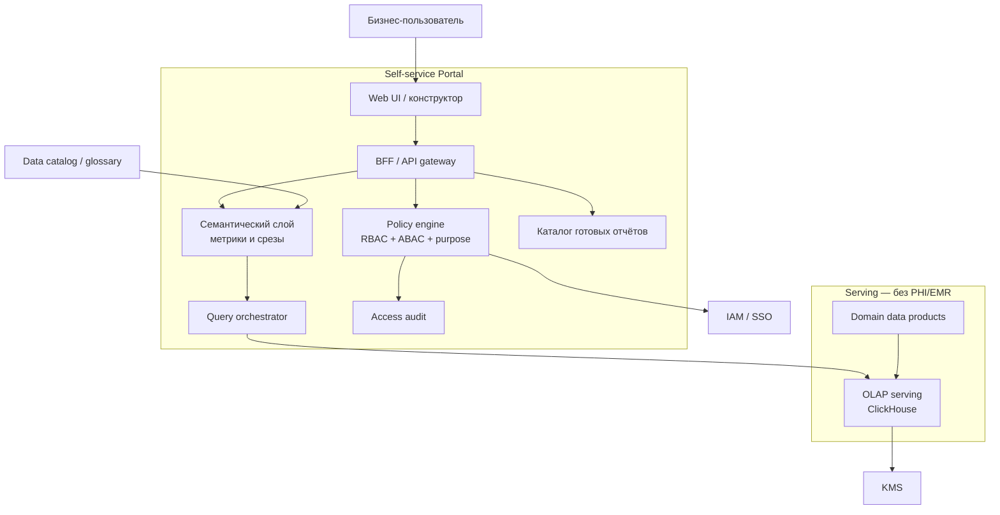
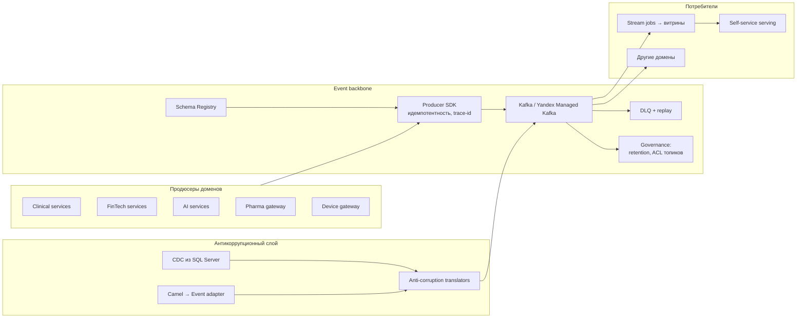

# C4: компоненты

Два среза, от которых зависит витрина и отказ от логики в DWH: **портал самообслуживания** и **событийная платформа** (включая мосты Camel/DWH).

## 1. Портал самообслуживания (витрина)

Требование бизнеса: сотрудник строит отчёт по любым срезам **в пределах своего доступа**. Медицинские карты в портал не попадают на уровне контракта данных, а не «договорённости аналитиков».

Компоненты и ответственность:

| Компонент | Зачем |
|-----------|--------|
| Policy engine | Роль + атрибуты (`domain`, `legal_entity`, `region`, `purpose=analytics`). Запрет классов `medical.record`, `diagnostic.result`. |
| Семантический слой | Единые KPI («загрузка клиники», «NPL», «time-to-diagnosis» как *срок*, без самого диагноза). |
| Query orchestrator | Только по зарегистрированным продуктам; запрет ad-hoc к сырому озеру. |
| Access audit | Журнал «кто какую витрину строил» — требование ИБ и 152-ФЗ. |
| Domain data products | Владелец — домен, не команда DWH. Контракт, SLO, схема в каталоге. |

ИИ-домен **не** публикует в serving портала эмбеддинги снимков и тексты заключений. Максимум — операционный продукт `ai_sla` (латентность, доля авторазметки).

## 2. Событийная платформа и мосты

Правила, без которых шина снова станет «Camel 2.0»:

1. Контракт события в Schema Registry **до** записи в топик (compatibility BACKWARD).
2. DLQ обязателен на каждом критичном консьюмере; replay — отдельная операция, не «переложить из DWH».
3. CDC и Camel adapter переводят легаси-модель в канонические события, а не тащат таблицы SQL Server в витрину как есть.
4. Синхронные вызовы на критическом пути (клиника ↔ банк ↔ ИИ) к 36 месяцу запрещены политикой архитектуры; исключение — authorization/payment confirm с явным timeout и circuit breaker.

## 3. Компоненты ИБ на стыке медицины и банка

Один человек может быть и пациентом, и заёмщиком. Это **не** повод для единого хранилища ПДн.

- Отдельные ключи KMS на клинический контур и на финтех.
- Согласие (`purpose`) проверяется и при клинике, и при витрине.
- Корреляция клиентских профилей — через токенизированный `party_id`, не через паспорт в Kafka.
- Геораспределение: медданные региона не реплицируются «на всякий случай» в аналитический folder штаб-квартиры.
