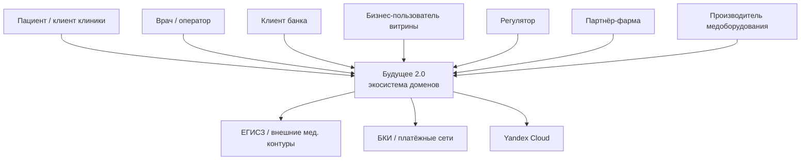
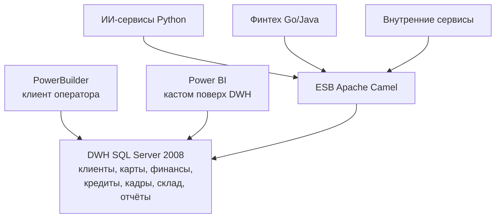
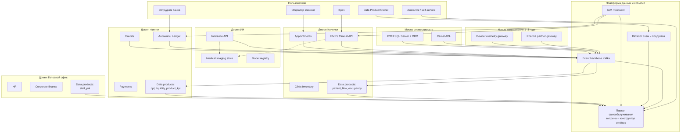

# C4: контейнеры (целевое состояние, 3 года)

Модель описывает, **как изменятся ключевые системы** при масштабировании: новые бизнес-направления (фарма, медтехника), новые источники событий и контролируемый отказ от SQL Server 2008, PowerBuilder и Camel как центра интеграции.

## 1. Контекст (C4 L1)

«Будущее 2.0» — экосистема клиник, банка и ИИ. Внешние акторы: пациенты и клиенты банка, врачи, аналитики доменов, регуляторы (152-ФЗ, отраслевые требования ЦБ и здравоохранения), партнёры фармы и производители оборудования.

## 2. As-is: один DWH и шина Camel

Сейчас почти вся логика и все классы данных сходятся в SQL Server 2008 и ESB. Power BI и PowerBuilder читают DWH напрямую. Это объясняет часы на отчёт и риск смешения медицинских и финансовых данных.

Проблемы as-is, которые to-be обязан снять:

- DWH — и система записи, и интеграционная шина, и витрина.
- Медицинские снимки и карты лежат рядом с кредитами.
- Новое направление = новая порция логики в DWH и новые маршруты Camel.
- Нет доменных границ: time-to-market доменов связан общим релизом склада данных.

## 3. To-be: контейнеры по доменам

Каждый домен владеет своими сервисами и **продуктами данных**. Интеграция — событиями. Camel и DWH остаются **мостами совместимости**, не центром.

Витрина самообслуживания потребляет только обезличенные и управленческие продукты: клиентский поток, финансы, кадры, склад, KPI клиник. **Нет** EMR, **нет** результатов исследований, **нет** сырых снимков.

Пунктир у imaging: медицинские бинарные данные **не** публикуются в Kafka как payload витрины. В шину уходит факт «исследование завершено» с идентификаторами и статусом, не снимок.

## 4. Что происходит с легаси

| Система | Через 6 мес. | Через 18 мес. | Через 36 мес. |
|---------|--------------|---------------|---------------|
| PowerBuilder | тонкий клиент поверх Clinical API | только редкие сценарии | выведен |
| SQL Server DWH | система записи + CDC наружу | read-модель для старых отчётов | архив / мост |
| Camel | все внешние маршруты через ACL | только партнёры, которых не успели перевести | точечные коннекторы |
| Power BI | читает новые витрины + старый DWH | только self-service портал / семантический слой | кастомизации сняты |

Отказ от легаси обоснован: SQL Server 2008 вне поддержки, PowerBuilder не масштабируется на новые домены, Camel синхронно связывает независимые бизнесы. Сохранять их как ядро — дороже, чем мост на время миграции.

## 5. Масштабирование: география и новые источники

- **Регион 2 и 3:** отдельные folder/VPC, репликация событий, локальные контуры ПДн. Витрина штаб-квартиры видит агрегаты, не сырые медданные региона.
- **Фарма:** события `DrugSupplyRegistered`, `RecallIssued` — отдельный bounded context, антикоррупционный слой к чужим API.
- **Медтехника:** телеметрия устройств — отдельный топик, в витрину только эксплуатационные KPI (uptime, калибровка), не диагностические ряды пациента.
- **Near-real-time:** отчётность клиник и банка переходит с ночного batch DWH на потоковые витрины (см. Task4 и Task5).
