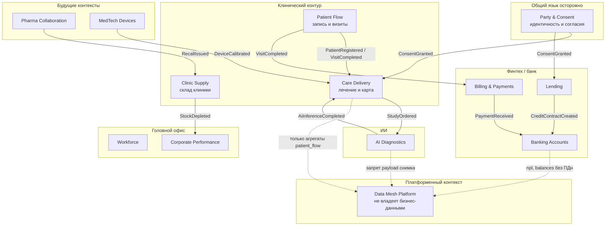

# Bounded contexts

Деление по **бизнес-смыслу и языку**, не по текущим таблицам SQL Server. В DWH сейчас смешаны клиенты, карты, кредиты и склад — это не домены, это склад таблиц.

## Карта контекстов

Пунктир к Mesh — публикация **продукта данных**, не сырого агрегата. Mesh не является bounded context клиники и не имеет права читать EMR.

## Язык и границы

| Контекст | Единый язык | Не входит внутрь |
|----------|-------------|------------------|
| Care Delivery | случай, назначение, карта, исследование | кредитный договор, зарплата врача как HR-сущность |
| Patient Flow | слот, визит, no-show | содержимое карты |
| Clinic Supply | партия, остаток, срок годности | клинический исход |
| Party & Consent | party, согласие, цель обработки | диагноз, сумма кредита |
| Banking Accounts | счёт, проводка, баланс | визит к врачу |
| Lending | заявка, договор, лимит, просрочка | медкарта как залог данных |
| Billing | счёт за услугу клиники / комиссия | проводки core-банкинга (их эмитит Banking) |
| AI Diagnostics | заказ на инференс, артефакт, модель | витрина self-service |
| Workforce | сотрудник, ставка, смена | доступ к карте (это IAM внутри Care) |
| Data Mesh Platform | продукт, контракт, SLO, схема | бизнес-инварианты доменов |
| Pharma / MedTech | поставка, отзыв серии, телеметрия прибора | хранение карт |

## Shared kernel и антикоррупция

- **Party & Consent** — единственный допустимый shared kernel. Даже он не хранит диагноз и кредитный рейтинг.
- Между банком и клиникой — **ACL**: клиника не вызывает API кредитного скоринга «заглянуть в карту». Скоринг, если когда-либо понадобится, идёт от отдельного согласованного продукта и отдельного согласия — сейчас это **Hold**.
- Camel и таблицы DWH отображаются в события через ACL; имена полей SQL Server не становятся каноническим языком.

## Витрина и контексты

Портал самообслуживания — **приложение платформенного контекста**. Он подписывается на продукты:

- `patient_flow` (Patient Flow) — загрузка слотов, без диагноза
- `clinic_ops` (Care + Supply) — операционные KPI
- `fintech_kpi` (Banking + Lending)
- `workforce_kpi` (Workforce)
- `ai_sla` (AI Diagnostics) — латентность, не заключение

Не публикуются: `MedicalRecord`, снимки, полный текст заключения, сырые признаки модели.
