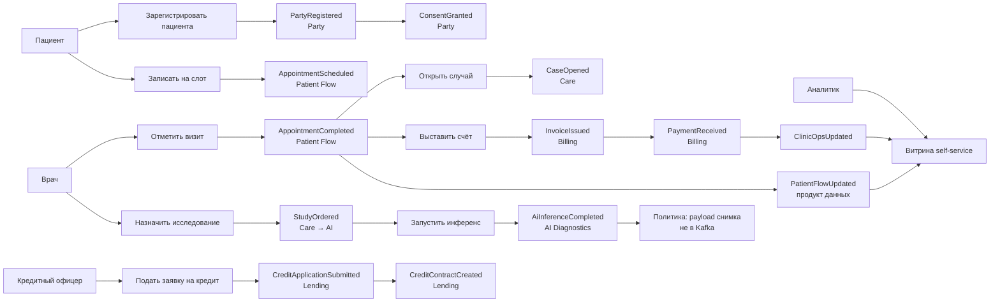

# Event Storming (целевой поток)

Оранжевый — доменное событие; синий — команда; жёлтый — актор; розовый — политика/согласование; зелёный — read-модель / витрина. Источник события указан в подписи.

## Сквозной сценарий: визит → исследование ИИ → счёт → (опционально) кредит

Пациент уже может быть клиентом банка: это **два контекста**, связь только через `party_id` и согласия.

## Кто публикует, кто подписан

| Событие | Источник | Подписчики |
|---------|----------|------------|
| `PartyRegistered` | Party | Patient Flow, Lending (KYC-старт), Mesh не читает ПДн |
| `ConsentGranted` / `Revoked` | Party | все домены-обработчики; портал отзывает доступ к продуктам |
| `AppointmentScheduled` | Patient Flow | Workforce (нагрузка врача), Mesh `patient_flow` |
| `AppointmentCompleted` | Patient Flow | Care, Billing, Mesh |
| `CaseOpened` | Care | AI (контекст заказа), **не** портал |
| `StudyOrdered` | Care | AI Diagnostics |
| `AiInferenceCompleted` | AI | Care (врач видит статус/ссылку) |
| `InvoiceIssued` / `PaymentReceived` | Billing | Banking (если эквайринг), Mesh `clinic_ops` |
| `CreditContractCreated` | Lending | Banking Accounts, Mesh `fintech_kpi` |
| `StockDepleted` | Clinic Supply | Workforce/закупки, Pharma позже |
| `RecallIssued` | Pharma | Clinic Supply |
| `DeviceCalibrated` | MedTech | Care (допуск прибора) |

## Политики на доске (розовые стикеры)

1. Нет согласия `treatment` → нельзя `CaseOpened`.
2. Нет согласия `diagnostics` → нельзя `StudyOrdered`.
3. Витрина подписана только на `*Updated` продукты, не на `CaseNoteAdded`.
4. `CreditApplicationSubmitted` не содержит и не запрашивает EMR.
5. Необработанное событие → DLQ, не «положить в DWH руками».

## Расширение на 3 года

Те же правила для `DrugSupplyRegistered` и телеметрии устройств: новое направление = новый продюсер и контракт, **без** новой хранимой процедуры в DWH.
