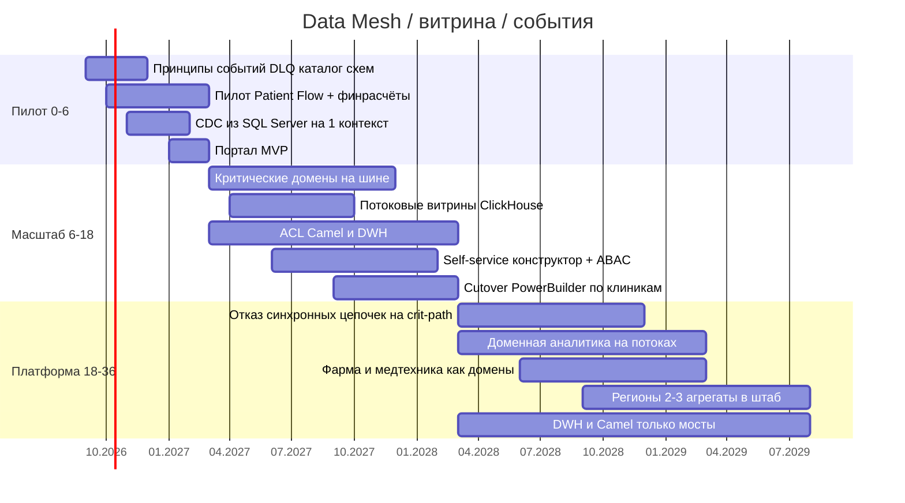

# Стратегический роадмап Data Mesh

Роадмап стыкует этапы трансформации из брифа (0–6 / 6–18 / 18–36 мес.) с продуктами, ролями и бизнес-целями: витрина самообслуживания, независимость доменов, новые направления, near-real-time, события вместо Camel/DWH как ядра.

## Роли

| Роль | Где сидит | За что отвечает |
|------|-----------|-----------------|
| **Data Product Owner** | Каждый бизнес-домен (клиники, финтех, HQ, позже фарма) | Контракт продукта, SLO, приоритет срезов для витрины, «можно ли поле» |
| **Data Engineer** | Домен (70%) + платформа (ротация) | Пайплайн продукта, схема, качество, outbox |
| **BI-аналитик** | Домен, не центральный DWH | Семантика KPI, обучение пользователей портала, инвентаризация старых отчётов |
| Platform engineer | Платформа | Kafka, каталог, IAM витрины, Terraform, DLQ |
| CISO / Privacy | Горизонталь | Классы данных, запрет EMR в serving |
| Архиткомитет | HQ | Freeze Camel, исключения dual-write |

Центральная «команда DWH» **не** владеет продуктами. Она превращается в платформу и в команду моста (CDC), затем сжимается.

## Этапы

Даты условные от старта «сентябрь 2026»; сдвигать можно, порядок — нет: **сначала контракт и пилот, потом портал на всю компанию**.

## Привязка к бизнес-целям

| Цель из брифа | Когда в роадмапе | Что должно быть правдой |
|---------------|------------------|-------------------------|
| Архитектура согласована, границы доменов ясны | к 2–3 мес. | Карта контекстов + каталог событий приняты архкомитетом |
| В доменах запланированы проекты витрины | пилот | Назначены DPO, бэклог 3 продуктов |
| Портал самообслуживания | конец пилота → масштаб | MVP без PHI, затем конструктор |
| Пользователи работают в новой архитектуре | 6–18 | Клиника и банк читают свои продукты, не ждут ETL |
| Легаси допустимо точечно | 6–18 | Hold + ACL, не новые фичи в SQL 2008 |
| Продукты / ИИ-монетизация | 18–36 | ИИ остаётся доменом; наружу — SLA-продукты, не снимки |
| География | 18–36 | Residency, агрегаты в штаб |
| Near-real-time вместо batch | 6–18 пилот KPI, 18–36 норма | Потоковые витрины как source of truth для операционных KPI |
| Слабосвязанная событийная платформа | 36 | Camel/DWH в реестре мостов, не в реестре систем записи |

## Операционные правила Mesh на всём горизонте

1. Нет DPO — нет публикации продукта в портал.
2. Поле класса `medical.record` / `diagnostic.result` в продукте — блокер релиза (автотест контракта).
3. Новый партнёр (фарма, девайсы) заходит как домен или gateway-контекст, не как таблица DWH.
4. Платформа продаёт **золотые пути** (SDK, Terraform-модуль VM, pipeline витрины), не делает витрины за домены.

## Критерий «готово» на 36 месяце

- Бизнес-пользователь в клинике и в банке собирает отчёт в портале за минуты в рамках доступа.
- Новое направление подключается контрактом события, без квартала хранимок.
- SQL Server и Camel не принимают новую логику; объём данных в них не растёт.
- TCO года 3 ниже as-is при живых FinOps-квотах (см. tco-analysis.md).
