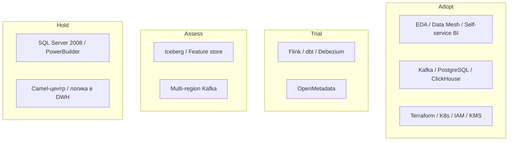

# Расширенный технический радар

Статусы [ThoughtWorks](https://www.thoughtworks.com/radar): **Adopt** — ставим в пилот и стандарт; **Trial** — проверяем на одном домене; **Assess** — изучаем; **Hold** — не развиваем, только поддерживаем на время моста.

Радар покрывает не только продукты, но и **архитектурные паттерны**, как требует задание.

## Сводная таблица

| Элемент | Тип | Статус | Зачем «Будущему 2.0» |
|---------|-----|--------|----------------------|
| Domain-Driven Design / Bounded Contexts | паттерн | Adopt | Развязать клиники, банк, ИИ, HQ |
| Event-Driven Architecture | паттерн | Adopt | Цель 3 лет: домены через события |
| Data Mesh | паттерн | Adopt | Витрина масштабируется числом доменов, не размером ETL-команды |
| Self-service BI | паттерн | Adopt | Портал отчётов в рамках доступа |
| Outbox + Schema Registry + DLQ | паттерн | Adopt | Контрактные события, без dual-write «на глаз» |
| Anti-Corruption Layer | паттерн | Adopt | Camel и DWH как мосты |
| Privacy by Design / deny medical в витрине | паттерн | Adopt | Карты и исследования вне аналитики |
| Infrastructure as Code (Terraform) | практика | Adopt | Одинаковые dev/stage/prod, см. Task1–2 |
| GitOps / CI с approval apply | практика | Adopt | State в S3, apply по кнопке |
| Kafka (Yandex Managed Kafka) | технология | Adopt | Спин событий |
| PostgreSQL (доменные системы записи) | технология | Adopt | Замена SQL Server как OLTP |
| ClickHouse | технология | Adopt | Serving витрин без PHI |
| Object Storage (S3) | технология | Adopt | State Terraform, lake, imaging (отдельный бакет ИИ) |
| Kubernetes + Yandex MKS | технология | Adopt | Сервисы доменов, масштаб регионов |
| OIDC / IAM Yandex + Keycloak | технология | Adopt | RBAC/ABAC портала |
| KMS | технология | Adopt | Разные ключи мед- и финконтура |
| OpenMetadata / DataHub | технология | Trial | Каталог продуктов и схем |
| dbt (трансформации продуктов) | технология | Trial | SQL-контракты витрин у домена |
| Apache Flink / Spark Structured Streaming | технология | Trial | Потоковые витрины |
| Debezium CDC | технология | Trial | Мост из SQL Server |
| Yandex Cloud (landing) | платформа | Adopt | Заявленный переезд в облако |
| Multi-region active-active Kafka | технология | Assess | География 2–3 региона |
| Lakehouse (Iceberg) | технология | Assess | Исторические срезы без возврата к моно-DWH |
| Feature store | технология | Assess | ИИ-домен, не витрина HQ |
| SQL Server 2008 | технология | Hold | Вне поддержки; только CDC-источник |
| PowerBuilder | технология | Hold | UI оператора до cutover |
| Apache Camel как ESB-центр | технология | Hold | Только ACL |
| Power BI с кастомизациями на DWH | технология | Hold | Замена семантическим слоем портала |
| Хранимая логика в DWH | паттерн | Hold | Новая логика только в доменах |
| Общая «золотая» MDM-база всех ПДн | паттерн | Hold | Смешивает банк и медицину |
| Синхронные цепочки клиника→банк→ИИ на критическом пути | паттерн | Hold | К 36 мес. запрещены политикой |

## Квадранты (кратко)

## Правила движения по радару

- Пилот (0–6 мес.): только **Adopt + один Trial** (CDC). Не тащить Iceberg в первый квартал.
- Trial → Adopt после SLO на одном домене (пациентский поток или финрасчёты).
- Hold не значит «выключить завтра»: это запрет **развивать**. Вывод — по роадмапу Task5.
